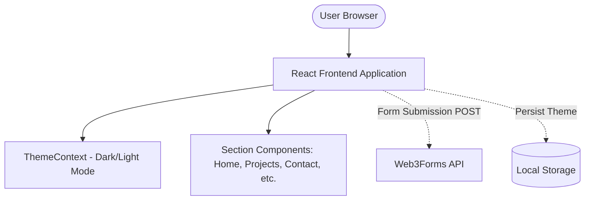

# Project Understanding & Architecture Guide

This guide provides a comprehensive overview of the portfolio project, designed to help human developers and AI coding agents quickly understand, modify, and extend the codebase. 

---

## 1. Project Overview
- **What it does:** A modern, single-page personal portfolio website to showcase a developer's skills, projects, education, internships, certifications, and achievements.
- **Problem it solves:** Acts as a centralized digital resume and project showcase to present professional experience and allow potential clients or employers to contact the developer.
- **Main users:** Recruiters, hiring managers, potential clients, and fellow developers.
- **Key features:** 
  - Smooth scrolling navigation with active section highlighting.
  - Dark/Light mode toggle with persistence.
  - Dynamic project filtering and display with animations.
  - Fully functional contact form without a backend.
  - Responsive design.

## 2. Tech Stack
- **Frontend:** React.js (v19.1.0)
- **Styling:** Vanilla CSS (component-scoped files)
- **Routing:** `react-router-dom` (using `HashRouter`)
- **Animations:** `framer-motion`
- **Icons:** `react-icons`, `@coreui/icons-react`
- **Scroll Management:** `react-scroll`, `react-intersection-observer`
- **Backend/Database:** None (Static site)
- **APIs / Third-Party Services:** [Web3Forms](https://web3forms.com/) for contact form submission. *(Note: `@emailjs/browser` is listed in dependencies, but the codebase uses Web3Forms via native `fetch`.)*
- **Build/Development Tools:** Create React App (`react-scripts`), `gh-pages` (for deployment).

## 3. Project Architecture
The project follows a **Client-Side SPA (Single Page Application)** architecture. 



### Key Architectural Decisions:
- **No Global State Management Library:** Uses React's Context API (`ThemeContext`) for the theme and local state (`useState`) for components.
- **Static Data:** Project data, education details, etc., are hardcoded as arrays within their respective component files (e.g., `Projects.js`).
- **Scroll Tracking:** The main `App.js` component tracks the user's scroll position to dynamically update the active state of the `Navbar`.

## 4. Project Structure
```text
Portfolio/
├── public/                 # Static assets (images, index.html, etc.)
├── src/                    # Source code
│   ├── components/         # Reusable UI components & Sections
│   │   ├── About/
│   │   ├── Achievements/
│   │   ├── Certifications/
│   │   ├── Contact/        # Contains form logic and Web3Forms integration
│   │   ├── Education/
│   │   ├── Footer/
│   │   ├── Home/
│   │   ├── Internships/
│   │   ├── Navbar/         # Navigation with active state highlighting
│   │   ├── Projects/       # Contains hardcoded project data
│   │   └── Skills/
│   ├── context/            # React Contexts
│   │   └── ThemeContext.js # Dark mode logic
│   ├── App.js              # Main layout and scroll observation logic
│   ├── App.css             # Global app styles
│   ├── index.js            # React entry point, HashRouter, custom smooth scroll
│   └── index.css           # CSS Variables and global resets
├── package.json            # Dependencies and scripts
└── README.md               # Project documentation
```

## 5. Data Flow
Because the site is static, data flow is localized:
1. **Entering the System:** Data is hardcoded into arrays inside component files (e.g., `const projects = [...]` in `Projects.js`).
2. **Processing & Display:** Components iterate over these arrays (using `.map()`) to render cards, lists, or timeline items. `framer-motion` wraps these elements to provide entrance animations (`whileInView`, `initial`, `animate`).
3. **Form Data (Contact):** 
   - User types in form -> React local state (`formData`) updates.
   - User submits -> `onSubmit` triggers a `fetch` POST request containing `formData` and a hardcoded `access_key` to Web3Forms API.
   - API responds -> React local state (`formStatus`) updates to show success/error messages.

## 6. API & Database
- **Database:** None.
- **External API:** `https://api.web3forms.com/submit`
  - **Method:** `POST`
  - **Payload:** `{ access_key, from_name, from_email, message }`
  - **Purpose:** Relays the user's message to the developer's email inbox without requiring a backend server.

## 7. Feature Workflows
- **Dark/Light Mode:** 
  1. Handled by `ThemeContext.js`.
  2. On load, it checks `localStorage.getItem('theme')` or the system preference (`prefers-color-scheme`).
  3. When toggled, it updates state, adds/removes the `.dark` class on the `<html>` (`document.documentElement`) element, and updates `localStorage`.
- **Active Section Highlighting:**
  1. `App.js` utilizes both `react-intersection-observer` (`useInView`) hooks AND a custom scroll event listener.
  2. As the user scrolls, `App.js` calculates which section (`id`) is currently intersecting the viewport.
  3. The `activeSection` state is passed down to the `Navbar` component, which applies an "active" CSS class to the corresponding link.
- **Smooth Scrolling:**
  1. Handled globally in `index.js` by overriding the native `window.scrollTo` method with a custom easing function (`easeInOutCubic`) and requestAnimationFrame implementation.

## 8. How to Run the Project
- **Prerequisites:** Node.js and npm installed.
- **Installation:** Run `npm install` in the root directory.
- **Start Development Server:** Run `npm start`. (App runs on `http://localhost:3000`).
- **Build for Production:** Run `npm run build`.
- **Deploy:** Run `npm run deploy` (This script builds the app and publishes the `build` directory to the `gh-pages` branch).

## 9. How to Modify the Project
### Updating Portfolio Content
- **Projects:** Edit the `projects` array in `src/components/Projects/Projects.js`.
- **Contact Email / API Key:** If changing the Web3Forms key, modify the `access_key` payload inside `src/components/Contact/Contact.js`.
- **Adding a New Section:**
  1. Create a new folder/component in `src/components/`.
  2. Import it into `src/App.js`.
  3. Add a new `useInView` ref and include the section's ID in the `sections` array within the scroll listener in `App.js`.
  4. Pass the ref to a wrapper div around your new component in the return statement.
  5. Add a corresponding navigation link in `Navbar.js`.

### Modifying Styles
- **Theme Colors:** Edit the CSS variables (`--primary-color`, `--bg-color`, etc.) in `src/index.css`. Both light and dark theme (under `.dark` selector) variables are defined there.
- **Component Styles:** Edit the specific `.css` file next to the component (e.g., `Projects.css`).

## 10. Important Dependencies & Relationships
- **Framer Motion:** Tightly coupled with components for animations (look for `<motion.div>` tags and `variants` objects).
- **React Router:** Uses `HashRouter` (in `index.js`), meaning URLs will look like `/#/`. This is highly compatible with GitHub Pages hosting.
- **React Intersection Observer:** Used heavily in `App.js` for scroll spy functionality. Do not remove unless replacing the entire scroll spy system.

## 11. Known Issues / Technical Debt
- **Duplicate Scroll Tracking:** `App.js` initializes multiple `useInView` hooks for every section but also implements a manual `window.addEventListener('scroll')` to track the `activeSection`. This is redundant and could cause performance overhead.
- **Unused Dependencies:** `@emailjs/browser` is in `package.json` but the actual implementation uses Web3Forms via native `fetch`.
- **Hardcoded Data:** Content (projects, education, etc.) is hardcoded directly inside component files instead of a central configuration or data file, reducing separation of concerns.

## 12. Developer & AI Agent Guidelines
- **DO NOT** convert static hardcoded arrays to a backend API unless explicitly requested; the static nature is intentional for a portfolio.
- **DO NOT** modify the custom `window.scrollTo` override in `index.js` unless fixing a specific scrolling bug, as the site relies on it for smooth navigation.
- **DO** keep styles scoped to their respective component CSS files. Avoid adding massive styling blocks to `App.css` or `index.css` unless they are global utility classes or CSS variables.
- **DO** ensure any new icon imports use either `react-icons` or `@coreui/icons-react` as they are already bundled.
- **Testing after modifications:** Always verify that scrolling still accurately updates the Navbar active state and that Dark/Light mode still toggles correctly across all modified components.

## 13. Quick Reference Cheat Sheet
- **Tech Stack:** React 19, Vanilla CSS, Framer Motion, HashRouter.
- **Architecture:** Client-side SPA, No Database.
- **Important Folders:** `src/components/` (UI & Content), `src/context/` (Theme).
- **Critical Files:** 
  - `src/App.js` (Layout & Scroll Spy)
  - `src/index.js` (Router & Smooth Scroll Override)
  - `src/index.css` (Global styles & Theme variables)
- **External APIs:** Web3Forms (used in `Contact.js`).
- **Run Command:** `npm start`
- **Deploy Command:** `npm run deploy` (via gh-pages)
